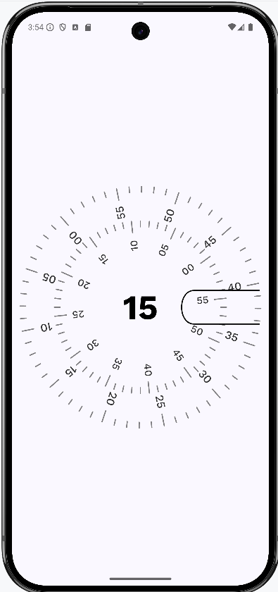

# Analog Clock with Customizable Styles in Jetpack Compose

This project demonstrates how to create a fully customizable analog clock using Jetpack Compose, the modern UI toolkit for Android. It showcases advanced drawing techniques with `Canvas`, real-time time updates, text rotation, and multiple clock styles.

## Features

-   **Analog Clock:** A visually appealing analog clock face with hour, minute, and second hands.
-   **Customizable Styles:** Multiple built-in clock styles (Standard, Marron, Light, Brown) and the ability to easily create new ones.
-   **Real-time Updates:** The clock hands move smoothly in real-time, updating every second.
-   **Custom Drawing:** Utilizes Jetpack Compose's `Canvas` to draw the clock face, hands, and minute/second dials.
-   **Text Rotation:** Demonstrates how to rotate text at any angle using `Canvas` transformations.
-   **Rotated Text Measurement:** Accurately measures the size of rotated text to ensure proper layout.
-   **Clean Code:** Follows Kotlin and Jetpack Compose best practices for readability and maintainability.
-   **Modern Time API:** Uses the modern `java.time` API for handling time.

## Screenshots

<!-- Add screenshots or GIFs here -->

## Getting Started

### Prerequisites

-   Android Studio (latest version recommended)
-   Android SDK (API level 26 or higher)
-   Basic knowledge of Kotlin and Jetpack Compose

### Installation

1.  **Clone the repository:**
2.  **Open in Android Studio:**
    -   Open Android Studio and select "Open an existing Android Studio project."
    -   Navigate to the cloned repository directory and select it.

3.  **Build and Run:**
    -   Connect an Android device or start an emulator.
    -   Click the "Run" button in Android Studio.

## Usage

The main composable function is `ClockFace()`. You can include it in your Compose UI like this:

kotlin 
import androidx.compose.foundation.layout.fillMaxSize 
import androidx.compose.runtime.Composable 
import androidx.compose.ui.Modifier 
import com.yourpackage.ClockFace 
import com.yourpackage.ClockStyles.StandardClockStyle

@Composable 
fun MyScreen() { 
    ClockFace(modifier = Modifier.fillMaxSize( ,  
    clockStyle = StandardClockStyle) 
}

You can easily change the clock style by passing a different `ClockStyle` object:

kotlin import com.yourpackage.ClockStyles.MarronStyle
// ... ClockFace( 
            modifier = Modifier.fillMaxSize() ,  
            clockStyle = MarronStyle 
        )

## Code Structure

-   **`ClockFace.kt`:** Contains the main `ClockFace` composable function, which draws the entire clock.
-   **`ClockDial.kt`:** Contains the `clockDial` function, which draws the minute and second dials.
-   **`ClockStyle.kt`:** Defines the `ClockStyle`, `DialStyle` data classes, and the `ClockStyles` object with the predefined styles.
-   **`rememberCurrentTime.kt`:** Contains the `rememberCurrentTime` composable function for getting the current time.
  - **`RotatedText.kt`**: Contains the composable function for drawing rotated text.

## Dependencies

-   **Jetpack Compose:**
    -   `androidx.compose.ui:ui`
    -   `androidx.compose.material:material`
    -   `androidx.compose.ui:ui-tooling-preview`
    -   `androidx.compose.ui:ui-graphics`
-   **Kotlin Coroutines:**
    -   `org.jetbrains.kotlinx:kotlinx-coroutines-android`
-   **Android Core KTX:**
    -   `androidx.core:core-ktx`

## Contributing

Contributions are welcome! If you'd like to contribute to this project, please follow these steps:

1.  Fork the repository.
2.  Create a new branch for your feature or bug fix.
3.  Make your changes and commit them.
4.  Push your changes to your forked repository.
5.  Submit a pull request.

## License

This project is licensed under the MIT License - see the [LICENSE](LICENSE) file for details.

## Contact

Your Name - [forteanjo@sky.com](mailto:forteanjo@sky.com)

Project Link: [https://github.com/forteanjo/analog-clock-compose](https://github.com/forteanjo/analog-clock-compose)
**Key Improvements in this README:**

1.  **Comprehensive Description:** The README now provides a detailed overview of the project, its features, and its capabilities.
2.  **Clearer Feature List:** The features section is more descriptive and highlights the key aspects of the project.
3.  **Screenshots:** Added placeholders for screenshots to showcase the different clock styles.
4.  **Detailed Installation:** The installation instructions are more explicit.
5.  **Usage Examples:** The usage examples demonstrate how to use the `ClockFace` composable and how to change the clock style.
6.  **Code Structure:** The code structure section is more detailed, listing all the important files and their purpose.
7.  **Dependencies:** The dependencies section is more complete.
8.  **Contributing:** The contributing section is standard and clear.
9.  **License:** The license section is standard.
10. **Contact:** The contact section is standard.
11. **Project Link:** The project link is added.
12. **Badges:** The badges are added.
13. **API Level:** The API level badge is added.

**How to Use This README:**

1.  **Create `README.md`:** Create a file named `README.md` in the root directory of your Git repository.
2.  **Paste the Content:** Copy and paste the content of this template into your `README.md` file.
3.  **Customize:**
    *   Replace `your-username` with your GitHub username.
    *   Replace `analog-clock-compose` with your repository name.
    *   Replace `screenshots/screenshot1.png`, `screenshots/screenshot2.png`, etc., with the actual paths to your screenshots.
    *   Replace `your-email@example.com` with your email address.
    *   Replace `Your Name` with your name.
    * Replace `com.yourpackage` with your package name.
    * Add more files to the code structure section if necessary.
4.  **Add Screenshots:**
    *   Take screenshots of your app.
    *   Place them in a `screenshots` folder in your repository.
    *   Update the image paths in the README.
5.  **Commit and Push:** Commit the `README.md` file to your repository and push it to GitHub.

This improved `README.md` will make your project much more appealing and accessible to other developers! Let me know if you have any other questions.
